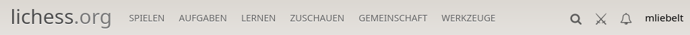
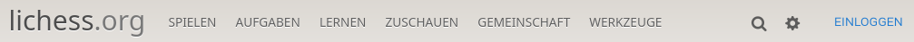
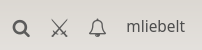
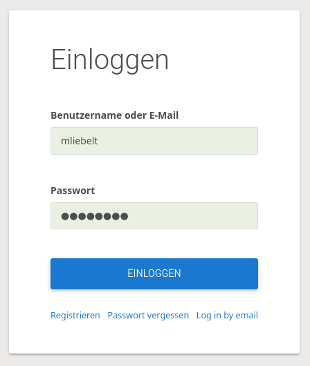
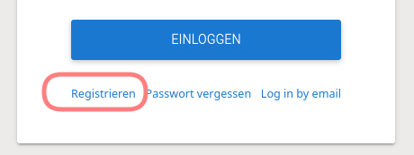
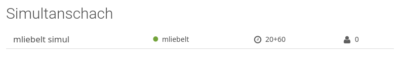

# Lichess

* [Installation von Lichess](#installation-von-lichess)
* [Aufruf von Lichess](#aufruf-von-lichess)
* [Anmeldung bei Lichess](#anmeldung-bei-lichess)
  * [Anmeldung](#anmeldung)
  * [Registrierung](#registrierung)
* [Aufbau von Lichess](#aufbau-von-lichess)
* [Nutzung von Studien](#nutzung-von-studien)
  * [Studie allgemein](#studie-allgemein)
  * [Studie für Analysen](#studie-für-analysen)
  * [Kapitel in Analyse-Studien](#kapitel-in-analyse-studien)
  * [Studien für Übungen](#studien-für-übungen)
  * [Studien für Partieanalysen](#studien-für-partieanalysen)
* [Erstellung und Nutzung eines Teams](#erstellung-und-nutzung-eines-teams)
* [Nutzung des Simultan](#nutzung-des-simultan)
* [Nutzung von internen Turnieren](#nutzung-von-internen-turnieren)
* [Weitere Möglichkeiten für das Training](#weitere-möglichkeiten-für-das-training)

Diese Datei enthält die wichtigsten Begriffe, die während des Workshops genutzt werden. Es wird bewusst darauf verzichtet, schon zu erklären, wie das Training mit der Hilfe von Lichess erfolgt. Dies erfolgt an einer anderen Stelle.

## Installation von Lichess

Wir nutzen Lichess immer im Browser (wenn möglich), deshalb ist keine Installation notwendig. Die Lichess-App auf Android (und vermutlich Apple-Geräten) bietet einen ähnlichen Funktionsumfang an. Die Nutzung von Lichess im Browser ist einfacher, und man hat auch alle Feature nur da.

## Aufruf von Lichess

Lichess ist eine umfangreiche Anwendung, die über das Internet erreichbar ist. Im Regelfall nutzen Benutzer bei Lichess ihren installierten Browser (Chrome, Firefox, MS Edge, ...). Der Browser sollte relativ aktuell sein, damit auch alle Möglichkeiten von Lichess uneingeschränkt genutzt werden können.

Lichess wird geöffnet, indem man die URL [https://lichess.org](https://lichess.org) öffnet. Man sieht dann die Homepage von Lichess, unter Umständen ist man schon angemeldet.

Es gibt auch Anwendungen für mobile Endgeräte, z.B. für das Handy, oder auch für Tablets. Diese sollen nun nicht weiter betrachtet werden, hier mag es teilweise Unterschiede geben, das Meiste wird aber für die Anwender gleich funktionieren.

Dabei muss man sich in der Benutzeroberfläche zuerst einmal zurechtfinden.

Unter den Buttons "SPIELEN" usw. verbergen sich jeweils Untermenüs, die werden in [Lichess Menüs](lichess.md) dargestellt werden.

Wichtig ist das Zahnrad, mit dem alle Einstellungen vorgenommen werden können. Ist man angemeldet, ist das unter dem Benutzernamen-Menü versteckt, sonst auf oberster Ebene rechts oben.

Wenn im Workshop oder in weiteren Abschnitten erklärt wird, wie man wohin kommt, wird meist folgende Syntax verwendet: `Spielen > Simultanschach` bedeutet dann, dass man im Menü `Spielen` das Untermenü `Simultanschach` aufrufen soll.

Die Menüstruktur ändert sich ein wenig, wenn man nicht angemeldet ist.

## Anmeldung bei Lichess

Man kann Lichess sofort nutzen, auch wenn man nicht angemeldet ist. Und im Training mit den Trainingsteilnehmern ist es meist nicht unterschiedlich, ob die Teilnehmer angemeldet sind oder nicht. Es ist besser, wenn alle, die Lichess regelmäßig nutzen, sich dort auch anmelden. Erst als angemeldeter Benutzer von Lichess kann man einige der Feature sinnvoll nutzen. Das wichtigste Feature hier ist, dass man Wertungspunkte nur gewinnen kann, wenn man angemeldet ist. Auch eine aktive Teilnahme an Studien geht erst angemeldet.

### Anmeldung

Wenn man sich schon registriert hatte, dann sollte

* entweder man schon angemeldet sein (siehe )
* oder sich durch Drücken des Buttons "EINLOGGEN" anmelden können. 

### Registrierung

Im Anmelde-Bildschirm gibt es eine Möglichkeit, sich zu registrieren.

Im folgenden Formular hat man einen Benutzernamen zu wählen, ein Passwort anzugeben (dabei sollte die Passwortstärke ausreichend sein) und eine Email angeben. Nach Bestätigung der Checkboxen und der Bestätigung, dass man ein Mensch ist, bekommt man eine Email geschickt, um die Anmeldung abzuschließen.

## Aufbau von Lichess

Es gibt einige Grundprinzipien, die hilfreich sind:

* Links oben (lichess.org) kommt man immer zur Homepage.
* Die Einstiege in die folgenden Teile sind:
  * Studien: `Lernen > Studien`
  * Simultan: `Spielen > Simultanschach`
  * Interne Turniere: `Gemeinschaft > Teams > Auswahl des Teams > Turniere links`
* Damit man interne Turniere spielen kann benötigt man ein Team.

## Nutzung von Studien

Bei der Nutzung von Studien sind einige Aspekte zu beachten, das Folgende ist deshalb als Vorschlag zu verstehen. Wir haben damit gute Erfahrungen gemacht.

* Studien haben maximal 64 Kapitel.
* 1 Kapitel ist im Regelfall eine Partie / 1 Problemstellung / 1 Thema.
* Studien können nach Themen verwaltet werden. Wir verwenden z.B.: Schach-AG, Mannschaft, Bauerndiplom, Übungen, Turniere, ...
* Themen können mehrfach angegeben werden, damit hat man gute Suchmöglichkeiten bei einer großen Studienanzahl.
* Es gibt bei Studien die Rollen:
  * Ersteller: nur er kann die Studie anpassen
  * Mitwirkender: ist gleichberechtigt zum Ersteller, kann (bis auf die Einstellungen) alle Inhalte ändern
  * Betrachter: hat Leserechte, sieht also alles in der Studie, kann aber nichts verändern
  * Sonstige: wenn eine Studie nicht geschützt ist, kann jeder die Studie wie ein Betrachter verwenden.
* Sichtbarkeit von Studien bestimmt, wer auf diese zugreifen kann:
  * Öffentlich: die Studie ist für alle Verwender von Lichess zugreif- und findbar. Meist nicht gewünscht, aber Voreinstellung
  * Ungelistet: die Studie kann von außen nicht gefunden werden, jeder mit dem Link zur Studie kann darauf zugreifen (und natürlich Ersteller/Mitwirkender/Betrachter)
  * Nur mit Einladung: nur Ersteller/Mitwirkender/Betrachter haben Zugriff. Wird bei uns nur in Ausnahmefällen verwendet.
  * Es kann noch definiert werden:
    * Kann die Studie kopiert werden?
    * Wer kann die Computer-Analyse verwenden? Wichtig, wenn man Kindern was beibringen möchte, die finden Stockfish auch wenn man es ihnen nicht zeigt ...
    * Wer kann die Eröffnungsdatenbank nutzen? Gilt vermutlich auch für die Endspieldatenbank
    * Wer kann den Chat nutzen?
  * Die wichtigste Eigenschaft ist, ob der Syn aktiviert ist oder nicht.

Daneben gibt es auch pro Kapitel noch Einstellungen. Kapitel können vom Ersteller oder Mitwirkenden erstellt und verändert werden. Hier die wesentlichen Einstellungen:

* Ausrichtung: weiß / schwarz, d.h. was ist unten (normalerweise weiß) am Brett
* Analysemodus: Das hat den größten Einfluss auf die Verwendung der Studie:
  * Normale Analyse: Alle Züge sind sichtbar von Beginn an. Verwendet beim Durchspielen von Partien.
  * Übe mit dem Computer: Nie verwendet
  * Nächste Züge ausblenden: Wichtig, wenn man ein Thema durchsprechen möchte. Was ist der nächste Zug, warum, was sind mögliche Kandidaten, ... Nur die bisher gespielten Züge sind fÜr die Betrachter und Sonstige sichtbar, der Ersteller/Mitwirkende sieht immer alle.
  * Interaktive Übung: Schöne Variante, Schüler können selbständig Übungen (mit Hinweisen) machen.

### Studie allgemein

Damit ich die Studien später wiederfinde habe ich hier ein Namensschema, das darf jeder machen, wie er mag. Bei mir heißen die Studien:

* Eröffnungen für Tiffany
* BJEM 22
* Schach-AG Bauerndiplom >= B12
* Übungen Rochadekids >= 53

Zudem vergebe ich für jede Studie mindestens 2-3 Themen, z.B. Schach-AG, Bauerndiplom für Anfängermaterial für  die Schach-AG; Schach-AG, Läuferdiplom, Übungen für fortgeschrittene Übungen usw. usf.

### Studie für Analysen

Empfohlene Einstellungen sind:

* `Sync aktiviert`: damit alle immer die gleiche Stellung sehen
* `Computer-Analyse deaktiviert`: damit die Schüler selbst nachdenken müssen
* `Sichtbarkeit`: meist `ungelistet`, damit man sich die umständliche Einladung sparen kann, trotzdem nur für die Teilnehmer
* Pro Kapitel: `Nächste Züge ausblenden`, damit die Schüler sich selbst Gedanken machen.

### Kapitel in Analyse-Studien

Ich habe meist folgendes Schema verwendet, um mir die Orientierung zu erleichtern. Das darf aber jeder selbst tun:

* Jedes Thema hat ein Kürzel (RK für RochadeKids) und eine Nummer.
* Die einzelnen Kapitel haben dann eine Bezeichnung, und eine fortlaufende Nummer.

Beispiele hier sind:

* RK63 Guter Läufer/Schlechter Springer 1
* 2.2 Wahl Plan: Bessere Stellung 1 (Exzerpt aus Karpov: Stellungsbeurteilung und Plan)
* T07 Freibauer 1
* ...

### Studien für Übungen

Hier muss man nur darauf achten, dass alle Übungen durch die Schüler selbständig durchgespielt werden. Der wesentliche Unterschied zu vorher ist, dass `Analysemodus == Interaktive Übung` ist. Zudem ist die Partei, die am Zug ist, und für die der Schüler Züge finden soll, unten. D.h. wenn Schwarz am Zug ist, dann ist als Ausrichtung auch Schwarz gewählt.

### Studien für Partieanalysen

Partien sollen von den Schülern selbständig erfasst und auch analysiert werden. Damit das ohne Störung geht, muss für die gesamte Studie voreingestellt sein, dass unter `Sync aktivieren == Nein` eingestellt ist. Damit können z.B. Spieler nach einem Wettkampf gleichzeitig ihre Partie in derselben Studie erfassen, ohne sich gegenseitig zu stören.

## Erstellung und Nutzung eines Teams

* Erstellung
  * `Gemeinschaft > Teams > Neues Team`
  * Ausfüllen des Formulars
  * Entweder Beitrittsanfragen manuell prüfen oder Passwort vergeben (um die Teammitglieder zu begrenzen)
  * Der Ersteller ist  automatisch der Teamleader, und kann andere Teamleader noch bestellen.
* Beitritt
  * Beitrittsanfragen prüfen
    * Mögliche Mitglieder gehen auf die Teamseite.
    * Button "Tritt dem Team bei"
    * Anfrage verschicken.
    * Einer der Teamleiter muss dem zustimmen.
  * Passwort
    * Gleicher Ablauf wie oben.
    * Statt Prüfung durch andere Eingabe des Passworts.

Nach Erstellung des Teams sind die folgenden Varianten (Simultan, Turnier) teamintern erst möglich. Wichtig ist auch, dass die Schüler zum Team eingeladen werden, damit sie dort drin sind. Der Trainer kann nicht das Team selbst bestimmen, d.h. die Schüler müssen sich vorher bewerben, um dann aufgenommen werden zu können.

Damit wir zusammen üben können, habe ich mal das [Team ws220618](https://lichess.org/team/ws220618) erstellt, den Code dazu bekommt man auf Anfrage von Markus Liebelt.

## Nutzung des Simultan

Nachdem wir nun ein Team zur Verfügung haben, können wir auch ein Simultan nur für das Team erstellen. Das geht so:

* `Spielen > Simultanschach` aufrufen.
* Dort der Button `Ein Simultan veranstalten`.
* Einen passenden Namen wählen.
* Entscheiden, welche Varianten genutzt werden können. Üblich ist nur `Standard`.
* Man gibt die Grundbedenkzeit vor (für Simultanspieler und die Teilnehmer).
* Der Simultanspieler kann noch mehr Bedenkzeit fix dazubekommen.
* **Wichtig** Bei dem Dropdown `Nur Teammitglieder` das entsprechende Team auswählen.
* Als Anfangsposition kann ein FEN vorgegeben werden (der z.B. mit dem Bretteditor erstellt wird).
* Die Startzeit vorgeben.
* Die definierten Einstellungen mit `Ein Simultan veranstalten` abschicken.

Als Ergebnis bekommt man ein Simultan, die URL kann dann verwendet werden, um andere einzuladen. Man kann das Simultan auch auf der Teamseite finden.

## Nutzung von internen Turnieren

Es gibt verschiedene Möglichkeiten, interne Turniere zu veranstalten, hier die verschiedenen Möglichkeiten:

* Ausgehend von der Teamseite
  * `Team-Turnier`: Ein Arenaturnier, bei dem nur Teammitglieder mitmachen dürfen. Das Turnier läuft eine bestimmte Zeit, und wenn man eine Partie beendet hat, kann man sofort die nächste starten.
    * Einstellungen: Name, Variante, Bedenkzeit + Inkrement, Dauer, Startzeit, optional Anfangsposition (Thementurnier)
  * `Turnier nach Schweizer System`: Alle spielen in Runden, und warten nach dem Ende ihrer Partie, bis die nächste Runde startet.
    * Einstellungen: Name, Anzahl der Runden, gewertet/ungewertet, Variante, Bedenkzeit, Anfangsposition, Zeit zwischen Runden, Turnier-Startzeit, und einige weitere Parameter.
* Ausgehend von der Seite `Spielen > Arena-Turniere`
  * Button `Neues Turnier erstellen`
  * Parameter wie oben, über `Erweiterte Einstellungen` kann man auswählen, dass `Nur Teammitglieder` (unter Auswahl des Teams) teilnehmen können.
  * Die restlichen Einstellungen sind meines Wissens die gleichen, und zu verstehen.
* Ausgehend von der Seite `Spielen > Turniere nach Schweizer System`
  * Wichtig: Turnier nach Schweizer System können nur für Teams erstellt werden, sie sind nicht offen.
  * Man sieht hier also nur Turniere, die bereits (von anderen) erstellt wurden, und in deren Teams man ist.

## Weitere Möglichkeiten für das Training

Lichess bietet noch viele weitere Möglichkeiten, wir haben im Online-Training von den folgenden Optionen schon Gebrauch gemacht:

* `Aufgaben > Aufgaben`: Aufgaben können von den Schülern eigenständig und ohne Trainer durchgenommen werden. Dabei kann der Schüler sogar die Aufgabenthemen vorgeben, um bestimmte Themen zu üben.
* `Aufgaben > Aufgabenübersicht`: Hier kann der Schüler sehen, in welchen Bereichen er sich verbessern kann.
* `Aufgaben > Puzzle Streak`: Löse schwieriger werdende Aufgaben und baue eine Erfolgsserie auf. Es gibt keine Uhr, also nimm dir Zeit.
* `Aufgaben > Puzzle Storm`: Aufgaben nach Geschwindigkeit lösen.
* `Aufgaben > Puzzle Racer`: Das funktioniert online sehr gut, und es gibt auch die Variante, das nur unter den Schülern zu spielen. Ein Puzzle-Racer wird erstellt, der Link geshared, man wartet auf die Teilnehmer, und startet dann das Rennen. Jeder löst dieselben Aufgaben, bei einer gültigen Lösung fährt das Auto wieder ein Stück.
* `Lernen > Grundlagen`: Der Schüler kann eigenständig vordefinierte Themen durchnehmen. Es handelt sich dabei um öffentliche Studien, zum Selbstlernen. Siehe [dieses Kapitel](#studien-für-übungen), wie man das selbst erstellen kann.
* `Lernen > Trainieren`: Schachmatt-Übungen, Standard-Taktiken, Bauern- und Turmendspiele. Sehr gut zum Selbststudium geeignet, aber weniger fúr den Unterricht.
* `Lernen > Koordinaten`: Das haben wir im Unterricht vor Ort schon gezeigt, mit Beamer und Leinwand. Das trainiert die Erkennung der Felder.
* `Lernen > Studien`: Siehe die anderen Kapitel.

Der Puzzle-Racer funktioniert am Besten, einige andere Möglichkeiten hatten wir versucht, aber auch wieder verworfen.
