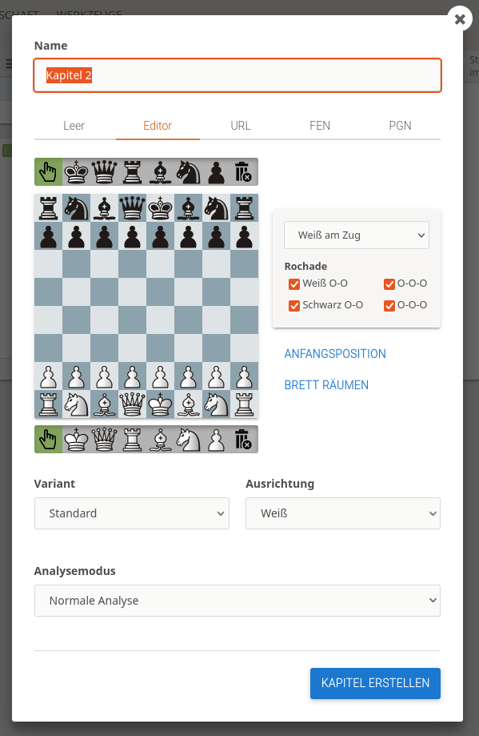

# Online Training

Diese Seite fasst die wesentlichen Aspekte des Online-Trainings zusammen. Dabei kommen wir nicht von den Hilfsmitteln, die wir einsetzen wollen (die sind nur referenziert, damit man die Details an anderer Stelle  nachlesen kann), sondern von dem, was wir trainieren möchten, und wie das vorbereitet und unterrichtet werden kann.

Was sind die verschiedenen Elemente?

* Klassischer Unterricht über Studien: Der Schachtrainer führt, zeigt Material, erklärt, die Schüler kommentieren, probieren aus, ...
* Lernmaterial für Schüler: Studien können auch dazu genutzt werden, Selbstlernmaterial zu erstellen. Das kann von den Schülern dann eigenständig durchgearbeitet werden.
* Partieanalysen: Vorbereitung, Selbstanalyse, Durchsprache im Unterricht, wie geht das mit Lichess?
* Turniere der Schüler (und Lehrer): Praktisches üben, freies Spiel, Wettbewerb.
* Simultan des Lehrers: Praktische Übung von Beispielstellungen, Endspieltraining praktisch, ...
* Sonstiges: Auflockerung, kleine Wettkämpfe, Vorschläge an die Schüler, ...

Natürlich sollte auch ein Online-Training eine Struktur haben, Abwechslung, einen lernenden und übenden Teil usw., das wird hier nur am Rande erwähnt.

* [Unterricht über Studien](#unterricht-über-studien)
  * [Erarbeiten des Themas](#erarbeiten-des-themas)
  * [Durchnehmen des Themas](#durchnehmen-des-themas)
* [Selbststudium](#selbststudium)
  * [Erarbeiten der Übungen](#erarbeiten-der-übungen)
  * [Durchgehen der Übungen](#durchgehen-der-übungen)
* [Partieanalysen](#partieanalysen)
  * [Vorbereitung der Analyse](#vorbereitung-der-analyse)
  * [Durchführen der Analyse](#durchführen-der-analyse)
* [Durchsprache der Analysen](#durchsprache-der-analysen)
* [Turniere der Schüler](#turniere-der-schüler)
  * [Team-Turnier](#team-turnier)
    * [Erstellung eines Team-Turniers](#erstellung-eines-team-turniers)
  * [Turnier nach Schweizer System](#turnier-nach-schweizer-system)
    * [Erstellung eines Turniers nach Schweizer System](#erstellung-eines-turniers-nach-schweizer-system)
* [Freies Spiel](#freies-spiel)
  * [Herausforderung anderer Spieler](#herausforderung-anderer-spieler)
  * [Herausforderung von Freunden](#herausforderung-von-freunden)
  * [Erstellung der Partie durch Trainer](#erstellung-der-partie-durch-trainer)
* [Simultan des Lehrers](#simultan-des-lehrers)
  * [Erstellung eines Simultan](#erstellung-eines-simultan)
  * [Teilnahme am Simultan](#teilnahme-am-simultan)
* [Sonstiges](#sonstiges)
  * [Aufgabenbereiche](#aufgabenbereiche)
  * [Puzzle Racer](#puzzle-racer)
  * [Koordinaten lernen](#koordinaten-lernen)
  * [Lernen trainieren](#lernen-trainieren)

## Unterricht über Studien

**Ausgangspunkt**: Wir haben ein Thema, und wollen das den Schülern nahebringen.

**Ziel**: Die Schüler sollten am Ende genügend über das Thema verstanden haben, um es dann in der Praxis auch anwenden zu können.

### Erarbeiten des Themas

1. Gibt es schon eine Studie, in die das Thema reinpasst? Es müssen so viele Kapitel noch frei sein (< 64), wie vermutlich benötigt werden.
2. Wenn nicht, muss erst eine neue Studie erstellt, und entsprechend benannt werden.

3. Erstellen eines Kapitels

dann

  * Sinnvollen Namen vergeben
  * Variant: Standard
  * Ausrichtung: Aus welcher Perspektive später zeigen?
  * Position bestimmen: den richtigen Tab wählen (die Züge kommen dann später)
  * Analysemodus: Nächste Züge ausblenden

Siehe die Studie [Anfänger: Schäfermatt verteidigen 1](https://lichess.org/study/eSxsNxVy/K4ZcQok3)

### Durchnehmen des Themas

Wenn man nun die Studie durchnehmen möchte, dann hat man oft den folgenden Ablauf (vorausgesetzt, das Erarbeiten ist komplett abgeschlossen):

1. Die Schüler bekommen über Discord den Link zur Studie zur Verfügung gestellt. Man verwendet dazu am besten "URL des aktuellen Kapitels".
2. Die Schüler sehen die gleiche Studie wie der Lehrer, und das gleiche Kapitel. Trotzdem: Pfeil-Test! Auf der Stellung einen Pfeil ziehen, und fragen, ob sie was sehen. (siehe SYNC-Thema)
3. Man geht wie sonst im Schachunterricht durch die Züge durch, die Kommentare sind (bei mir) oft Hinweise für den Trainer. Welche Fragen, wann pausieren, was sollen die Schüler selbst herausbekommen.
4. Ich verwende bei den wichtigen Zügen die Schachnotation (!, !!, ?, ...) sowie die Farben für Züge/Drohungen/Fehler/... Das muss jeder selbst herausbekommen, wo was wie nützlich ist. (siehe Nutzung von Lichess-Annotationen)

Hier noch einige Anmerkungen zur Nutzung der Studie dabei:

* Die Studie hat keinen (sinnvollen) read-only Modus. D.h. beim Durchnehmen der Lektion verändern sich die Kapitel. Wer das nicht möchte, der kann einfach die Studie kopieren, bevor er mit der Lektion beginnt.
* Wer bei der Studie mitwirkt, kann diese verändern. Das hat aber (leider) keine Auswirkung auf die Sichtbarkeit von Zügen. D.h. nur der Ersteller einer Studie kann mit Sichtbarkeiten sinnvoll arbeiten.
* Wenn die Schüler selbst Versuche auf dem Brett anstellen (und sie keine Mitwirkenden sind), dann wird das nicht in der Studie festgehalten.
* Wenn die Schüler selbst Versuche machen, dann kommen sie (bei einer Veränderung durch den Lehrer) aus der Synchronisation. Der vorher nicht sichtbare "SYNC" Knopf wird rot, und zeigt die Anzahl der Züge an, die der Schüler abweicht. Durch drücken des roten Knopfes ist man wieder in SYNC.
* Die Bedeutung der zwei Knöpfe SYNC und REC für den Lehrer:
  * SYNC: Abkoppeln von den Schülern. Beim erneuten Drücken von SYNC ist man wieder da, wo man vorher war. Für die Schüler ändert sich während der Zeit nichts.
  * REC: Die Aufnahme wird abgestellt, aber leider auch die Möglichkeit, synchronisiert durch die Züge zu gehen. Macht vielleicht dann Sinn, wenn man was ausprobieren möchte, bevor man es richtig aufzeichnet.

## Selbststudium

**Ausgangspunkt**: Die Schüler haben ein Thema vorgestellt und erklärt bekommen, und sollen nun an Übungen zeigen, dass sie es verstanden haben.

**Ziel**: Jeder Schüler sollte die Übungen absolvieren können, und am Ende eine Vorstellung haben, ob er erfolgreich war, d.h. alles verstanden hat, oder ob er noch Probleme hat.

### Erarbeiten der Übungen

Hier können ebenfalls Studien verwendet werden, um geführte Übungen durchführen zu können. Die dazu notwendigen Einstellungen sind (gegenüber den Einstellungen, die man beim Training hat):

1. Bestehende Studie verwenden, oder neue erstellen. Der Name der Studie sollte klar auf den Zweck hindeuten, gegebenenfalls kann man den Tag "Übung" vergeben.
2. Sync der Studie muss deaktiviert sein, damit die Schüler die Übungen eigenständig und in ihrem Tempo durchgehen können.
3. Bei jedem Kapitel angeben: Interaktive Übungen.
4. Die Züge von der Ausgangsstellung spielen, bei Bedarf zusätzlich mit Kommentaren oder Varianten unterstützen.

Siehe die Studie [Übungen zum Schäfermatt](https://lichess.org/study/RDKUJ6nv) zum Ausprobieren.

### Durchgehen der Übungen

1. Die Schüler bekommen über Discord den Link zur Studie zur Verfügung gestellt. Man verwendet dazu am besten "URL des aktuellen Kapitels".
2. Jeder Schüler spielt nun im eigenen Tempo die Übungen durch. Der Lehrer bekommt kein Feedback zum Ergebnis der Schüler. Jeder Schüler kann beliebig oft Züge probieren, bis er die richtigen gefunden hat.
3. Ich frage die Schüler dann nach angemessener Zeit, wie weit sie gekommen sind, damit wir dann zusammen weiter trainieren können.

## Partieanalysen

**Ausgangspunkt**: Die Schüler haben in Turnieren teilgenommen, und sollen ihre Partien dann selbständig analysieren.

**Ziel**: Die Analyse zeigt, dass der Schüler die wichtigsten Aspekte seiner Partie verstanden hat, und einige Fehler selbständig gefunden hat.

### Vorbereitung der Analyse

1. Der Trainer erstellt eine Studie, in der der Schüler Mitwirkender ist.
2. Der Trainer kopiert in die Studie die Partie des Schülers. Soll der Schüler seine Partie alleine analysieren und kommentieren, ist die Einstellung der Synchronisation egal. Soll er das mit jemand anderem machen (z.b. in einem separaten Kanal in Discord), dann muss die Synchronisation angeschaltet werden. Ich würde die Computeranalyse dann auch bewusst ausschalten, damit der Schüler auch nicht in Versuchung kommt, den Rechner die Analyse machen zu lassen.

### Durchführen der Analyse

1. Der Schüler bekommt über Discord den Link zur Studie.
2. Sollen mehrere Schüler zusammen analysieren, dann schiebt man die Schüler in unterschiedliche Räume, oder die Schüler machen dies selbst.

3. Die Schüler starten dann selbständig mit der Analyse, und können sich dabei ungestört unterhalten.
4. Der Lehrer kann von Zeit zu Zeit bei den Schülern im Raum vorbeischauen, und sie bei der Analyse unterstützen.

Wie man mit der Analyse der Schüler weiter umgeht wird im folgenden Kapitel besprochen.

## Durchsprache der Analysen

**Ausgangspunkt**: Die Analysen liegen vor.

**Ziel**: In der Durchsprache der Analysen findet man Lücken, nutzt einige der (zusätzlichen) Möglichkeiten von Lichess, und kommt zu tieferen Einsichten.

Der wesentliche Punkt hier ist, dass man nun von der eigenen Arbeit wechselt in den [Unterricht über Studien](#unterricht-über-studien). Von daher sind folgende Schritte notwendig:

* Die gesamte Studie wird umgestellt von nicht synchronisiert nach synchronisiert (falls die Umstellung notwendig ist).
* Gegebenenfalls wird erlaubt, Eröffnungsbücher und den Rechner zu verwenden.
* Die Durchsprache der Analyse durch den Schüler (der durch die Analyse führt) unterscheidet sich sonst nicht vom normalen Training.

## Turniere der Schüler

**Ausgangspunkt**: Die Schüler sollen praktisch in Partien Erfahrungen sammeln.

**Ziel**: Jeder hat Spaß gehabt und war mehr oder weniger erfolgreich.

Es stehen bei lichess verschiedenste Turniere zur Verfügung, nicht alle sind im Kontext von Training fÜr eine Gruppe von Schülern geeignet. Hier werden kurz die Turniere vorgestellt, die sich im Trainingskontext gut eignen.

Die meisten Turniere werden im Kontext von Teams durchgeführt. Wir verwenden im Training das [Team ws220618](https://lichess.org/team/ws220618).

* Teamkampf: Hier kann ein gemeinsames Turnier mit anderen Teams durchgeführt werden. Eher ungeeignet, es sei denn, man hat eine sehr große Trainigsgruppe, die man in mehrere Teams splittet.
* Team-Turnier: Ein Arenaturnier, in dem nur Mitglieder des Teams teilnehmen können. Sehr geeignet.
* Turnier nach Schweizer System: Ein Rundenturnier. Sehr geeignet.

Voraussetzung für alle Turniere im Team ist, dass die Teilnehmer des Trainings Teammitglieder sind. Siehe dazu [Beitritt zum Team](lichess.md#erstellung-und-nutzung-eines-teams).

### Team-Turnier

Arenatruniere sind Turniere, bei denen jeder Teilnehmer jederzeit ein- und aussteigen kann. Sobald eine Partie zueende ist, und der Teilnehmer nicht pausiert, wird er sofort wieder ausgelost. Team-Turniere machen erst ab einer Teilnehmerzahl von 6-8 Teilnehmern Sinn, und selbst dann kann es sein, dass einige Teilnehmer einige Zeit warten, dass sie wieder zugelost werden. Bei 15-20 Teilnehmern (und natürlich mehr) geht das aber reibungslos.

#### Erstellung eines Team-Turniers

Die Erstellung ist nur möglich über einen Teamleiter (der im Idealfall auch Trainer des Trainings ist).

1. Besuchen der Teamseite.
2. Dort Auswahl den Punktes "Team-Turnier" auf der linken Seite.
3. Festlegen der Parameter
   * Name des Turniers
   * Gewertet oder ungewertet
   * Variante (Default: Standard)
   * Bedenkzeit: Grund + Inkrement
   * Dauer in Minuten. Danach ist das Turnier automatisch zu Ende.
   * Zeit bis zum Start
   * Anfangsposition: Falls man eine bestimmte Stellung immer wieder durchprobieren möchte.
4. Drücken des Buttons "Neues Turnier erstellen".

Danach steht das Turnier, und die URL zum Turnier kann z.B. im Chat von Discord geshart werden.
Die Teilnehmer können dann einfach an dem Turnier teilnehmen.

Nach Klick auf dem Knopf sieht man das offene Arenda-Turnier, mit einem großen Button "Teilnehmen". Zusätzlich bekommt man den Hinweis, dass man nur als Teammitglied teilnehmen kann.

Nach der Anmeldung und vor dem Start sieht es dann so aus:

Wenn das Turnier dann läuft werden die Teilnehmer automatisch einander zugelost. Das Turnier endet dann nach der vorbestimmten Zeit.

### Turnier nach Schweizer System

Ein Schweizer Turnier läuft in Runden. Jeder Teilnehmer spielt in einer Runde gegen einen anderen Teilnehmer, der ungefähr die gleiche Anzahl Punkte hat. Eine Runde muss vollständig abgeschlossen sein, bevor die nächste Runde beginnen kann.

#### Erstellung eines Turniers nach Schweizer System

Auch hier müssen bei der Erstellung einige Parameter festgelegt werden. Ablauf:

1. Auf der Teamseite den Knopf "Turniere nach Schweizer System" drücken.
2. Dann die Parameter eintragen (es werden nur die unterschiedlichen Parameter zum Arena-Turnier beschrieben)
   * Anzahl der Runden: Das ist die Höchstzahl, bei weniger Teilnehmern werden entsprechend weniger Runden gespielt.
   * Zeitabstand zwischen den Runden. Bei automatisch bedingt die Bedenkzeit während der Runde, wie groß die Pause dazwischen mindestens ist.
   * Turnier-Startzeit: Festlegung des Datums und der Uhrzeit. Das Turnier startet dann automatisch. Vorher müssen die Teilnehmer sich noch anmelden.
   * Turnierbeitrittscode: Falls man die Teilnahme noch weiter einschränken möchte.
   * Verbotene Paarungen: Hier können Paarungen eingetragen werden, die nicht gelost werden dürfen.
3. Danach den Knopf "Neues Turnier erstellen" drücken.

Danach steht das Turnier, und die URL zum Turnier kann z.B. im Chat von Discord geshart werden.

## Freies Spiel

Wir hatten vor allem bei Anfängern oft das Problem, dass diese an Turnieren nicht teilnehmen wollten. Der Stress mit der Zeit, das Ranking, ... war alles schwierig für die Kinder. Wir hatten dann oft einfach nur freies Spiel gemacht, so wie es in der normalen Schach-AG/dem Jugendtraining auch passiert. Das ist mit Lichess natürlich möglich, aber nicht ganz so einfach zu finden.

* Herausforderung anderer Spieler
* Vereinbarung einer Partie durch den Trainer

### Herausforderung anderer Spieler

Möchte ein Schüler gegen einen bestimmten anderen Spieler spielen, dann geht das unter dem folgenden Mechanismus:

* Beide Schüler sind in Lichess angemeldet.
* Einer der Schüler sucht in seiner Freundesliste den anderen Schüler.
* Wenn er über dem Namen mit der Maus bleibt, erscheint ein Popup mit wesentlichen Möglichkeiten für die Interaktion mit dem Spieler.
* Wenn der Schüler nun auf das Icon mit den Schwertern klickt (zu einer Partie herausfordern), dann erscheint der Dialog zur Einladung zu einer Partie:
  * Variante: Voreinstellung Standard
  * Bedenkzeit: Voreinstellung Unbegrenzt
  * Gewertet oder Ungewertet
  * Mit welcher Farbe man spielen möchte:
    * Schwarz: der Herausforderer bekommt Schwarz

Dieser Ablauf ist meist nur durch ältere Kinder, die schon Erfahrung mit Lichess haben, zu leisten. Mit etwas technischem Hintergrund ist es möglich, dass der Trainer Partien für die Schüler erstellt.

Start Herausforderung

Nach Herausforderung warten

Dialog Herausgeforderter

### Herausforderung von Freunden

Hier ein leichterer Ablauf, der vielleicht zu leisten ist:

1. Der Schüler geht auf die Homepage, und wählt rechts "Spiele mit einem Freund" aus.
2. Er wählt die Einstellungen: Bedenkzeit, Variante, ...
3. Im Ergebnis bekommt er eine URL angezeigt, die muss er dem Freund (z.B. über Discord) zukommen lassen.
4. Der Freund klickt auf die URL, bestätigt im  Dialog, dass er an der Partie teilnehmen möchte, und die Partie beginnt.

### Erstellung der Partie durch Trainer

Mit ein wenig technischem Know-How kann man auch Partien für die Schüler erstellen:

1. Man erstellt ein Skript, das den REST-Endpunkt zur Erstellung von Challenges aufruft. Siehe das Skript unter [bin/licc.bash](./bin/licc.bash).
2. Das Skript dann ohne (keine Bedenkzeit) oder mit Bedenkzeit in Sekunden und Inkrement aufrufen.
3. Im Ergebnis steht die URL, die dann mit den Spielern geteilt wird.
4. Die zwei Spieler, die auf die URL klicken, spielen dann gegeneinander.

Das hat zu Zeiten sehr gut funktioniert, wenn ich mit jüngeren Kindern ohne Onlineerfahrung online trainieren wollte.

Voraussetzungen für den Trainer sind: Installation von Bash und Curl, Umgang mit der Kommandozeile. Ich habe leider noch keine einfachere Möglichkeit gefunden, die dann auch besser benutzbar ist.

Eine weitere Anforderung, die im Workshop geäußert wurde, ist, dass man die Stellung gerne vorgeben möchte, die dann von den Teilnehmern ausgespielt werden sollte. Siehe auch das Ticket [#4](https://github.com/mliebelt/schachtraining-lichess-discord/issues/4) das ich im Nachgang erstellt hatte, mit ein paar Ideen, wie man hier evtl. weiter kommen kann. Realistisch ist, dass man sich eine statische Webseite bastelt, in der die Parameter (Zeit, Inkrement, Position) eingetragen werden, so dass dann über Lichess eine "Challenge" erzeugt wird. Die Trainingsteilnehmer können dann den erzeugten Link nutzen, um die Partie zu starten.

## Simultan des Lehrers

**Ausgangspunkt**: Manche Lerninhalte können durch ein Simultan besser geübt werden. Manchmal macht es auch einfach Spaß, mit vielen gleichzeitig gegen einen Besseren zu spielen.

**Ziel**: Im Simultan kann jeder Schüler sehen, ob er das Gelernte umsetzen konnte.

### Erstellung eines Simultan

Ein Simultan wird immer über die Hauptnavigation erstellt.

1. Hauptmenu > Simultanschach
2. Dann Button "Ein Simultan veranstalten"
3. Hier wie bei allen Turnieren die Einstellungen wählen:
   * Name
   * Welche Varianten werden angeboten. Es ist möglich, die Schüler selbst wählen zu lassen, welche Varianten sie spielen wollen.
   * Grundbedenkzeit: Die Zeit, die alle Spieler (auch der Simultanspieler) zur Verfügung haben.
   * Extra Bedenkzeit: in Minuten
   * Farbe: weiß/schwarz/zufällig
   * Nur Teammitglieder: Hier Auswahl des Teams treffen, für die das Simultan durchgeführt werden soll.
   * Anfangsposition: Wenn das Simultan ab einer bestimmten Postion gespielt werden soll.
   * Startzeit: Datum und Uhrzeit.
4. Mit dem Button "Ein Simultan veranstalten" wird das Simultan angelegt.

### Teilnahme am Simultan

Hier der Ablauf:

* Der Link zum Simultan wird mit den Teilnehmern geshart (Discord).
* Die Teilnehmer können sich dann teils noch die Variante entscheiden, die sie spielen wollen.
* Sind alle Teilnehmer angemeldet, dann kann der Simultanspieler das Simultan beginnen.
* Er hat dabei die Möglichkeit, das Brett automatisch zu wechseln, wenn er das möchte.
* Andere Leute können beim Simultan zuschauen. Hat ein Spieler verloren, dann kann er einfach bei den anderen noch zuschauen.
* Ist das letzte Spiel im Simultan beendet, ist das Simultan beendet.

## Sonstiges

**Ausgangspunkt**: Wie kann man das Training noch abwechslungsreich gestalten?  Welche anderen Möglichkeiten von Lichess können auch im (Online-)Training eingesetzt werden?

**Ziel**: Varianz reinbekommen, Spaß haben, Abwechslung

Hier eine lose Liste der Dinge, die wir auf Lichess während des Trainings immer wieder mal tun:

* `Aufgaben > Aufgabenbereiche`: Hier können die Schüler selbst bestimmte Arten von Aufgaben lösen, und daran merken, ob sie bestimmte Techniken können oder nicht. Der Lehrer hat hier keine Kontrollmöglichkeiten.
* `Aufgaben > Puzzle Racer > Spiele mit Freunden`: Man stellt ein Rennen ein, bekommt einen Link, den man mit anderen shared. Sobald alle Teilnehmer sich eingetragen haben, wird das Rennen gestartet. Man muss nun um die Wette Aufgaben lösen. Bei jeder korrekten Lösung fährt das Rennauto eine bestimmte Strecke weiter.
* `Lernen > Koordinaten`: Viele Schüler haben noch Schwierigkeiten, die Koordinaten richtig zu finden. Hier muss man gegen die Uhr auf eine angesagte Koordinate klicken.
* `Lernen > Trainieren`: Hier kann jeder Schüler im selbstbestimmten Tempo Praktiken üben. Das geht von einfachen Mattaufgaben, über Standard-Taktiken wie Gabel oder Spieß bis zu bestimmten Endspielarten.

### Aufgabenbereiche

Aufgabenbereiche helfen Lichess-Nutzern, systematisch bestimmte Bereiche zu üben. Das können die Schüler aber nur alleine üben. Hier der Einstieg:

* `Aufgaben > Aufgabenthemen`: Hier kann der Schüler einen Aufgabenbereich wählen, den er üben möchte. Alternativ kann er sich fÜr den "Gesunden Mix" entscheiden.
* Sobald er sich für ein Motiv entschieden hat, geht es schon los. Der Schüler kann jederzeit die Aufgabenthemen wechseln, oder auch den Schwierigkeitsgrad anpassen.

### Puzzle Racer

Der Puzzle Racer ist eine nette Auflockerung, wenn der Wettbewerb etwas in den Hintergrund tritt. Hier geht es darum, dass Schüler im Wettbewerb immer schwerere Aufgaben schnell zu lösen. Bei jeder richtigen Lösung bekommt der Racer Punkte, die ihn näher zum Ziel bringen.

So geht es:

* Der Lehrer stellt über `Aufgaben > Puzzle Racer > Spiele mit Freunden` ein Rennen ein. 
* Im Ergebnis erhält er eine URL, die dann über Discord den Schülern mitgeteilt wird.
* Sobald alle, die mitmachen wollen, teilgenommen haben, startet der Trainer das Rennen.
* Nach der voreingestellten Zeit (90 Sekunden) ist das Rennen automatisch zu Ende.

Wir haben oft 3-4 Rennen nacheinander gemacht, um warm zu werden.

### Koordinaten lernen

Eine einfache Übung, die online natürlich viel besser geht. Hier blendet der Computer auf einem Brett eine Koordinate ein, die der Schüler dann treffen muss. Dann folgt die nächste. Ziel ist, möglichst viele Koordinaten richtig in 30 Sekunden zu finden.

So geht es:

* `Lernen > Koordinaten` auswählen. 
* Man kann dann bestimmen, ob das Brett zufällig gedreht, aus Weißer Sicht oder aus Schwarzer Sicht dargestellt wird.. 
* Über den Button "Training beginnen" beginnt das Training.

### Lernen trainieren

Hier stellt Lichess eine Vielzahl von vorbereiteten Übungen bereit, vergleichbar zu [Selbststudium > Durchgehen von Übungen](#selbststudium-durchgehen-von-uebungen). Der Unterschied hier ist, dass die Übungen zentral bereitgestellt werden, und ein Fortschritt durch Lichess getrackt wird. Man sieht also, welche Übungen man schon in der Vergangenheit (erfolgreich) gemacht hat, und welche noch offen sind.

So geht es:

* Man klickt auf eines der Themengebiete.
* Man hat automatisch das erste Kapitel der Studie.
* Nach jeder erfolgreichen Lösung geht es zum nächsten Kapitel.