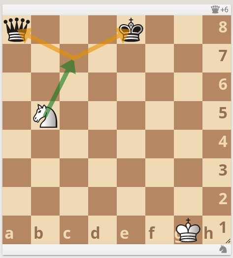
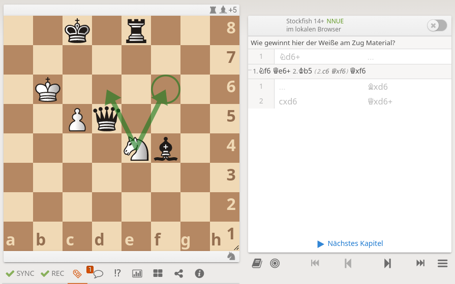

# Übungen

Die Übungen werden natürlich interaktiv durchgeführt, aber man sollte nachschauen können, oder auch später nachvollziehen können, was man im Workshop durchgenommen hat.

* [Training aus Sicht der Teilnehmer und Trainer](#training-aus-sicht-der-teilnehmer-und-trainer)
  * [Übung: Training als Trainer durchführen](#übung-training-als-trainer-durchführen)
* [Trainingsvorbereitung](#trainingsvorbereitung)
  * [Übung: Vorbereitung klassischer Unterricht](#übung-vorbereitung-klassischer-unterricht)
  * [Selbstlernmaterial erstellen](#selbstlernmaterial-erstellen)
* [Turniere erstellen und besuchen](#turniere-erstellen-und-besuchen)
* [Simultane erstellen und durchführen](#simultane-erstellen-und-durchführen)

## Training aus Sicht der Teilnehmer und Trainer

### Übung: Training als Trainer durchführen

**Aufgabenstellung** Führe ein Training mit der Studie XYZ durch, an dem dann 2 Teilnehmer teilnehmen können.

**Tipps** 
* Das Trainingsmaterial ist schon da (oder wird in der nächsten Übung dann erstellt)
* Wie kommen die Teilnehmer (online) ans Trainingsmaterial?
* Wie kann man prüfen, ob die Teilnehmer "drin sind"?
* Was kann alles schief gehen?

  
Und hier der konkrete Ablauf (als Vorschlag)

  
  <h3>Lösung Training durchführen</h3>
  <ol>
    <li>Zuerst muss man die Studie haben als URL: entweder die Studie selbst, oder das Kapitel: Lernen > Studien > Meine Studien > Studie anwählen ==> URL im Browser; Kapitel: Kapitel auswählen > Teilen und Exportieren > URL des aktuellen Kapitels.</li>
    <li>Einfügen der URL in den Textkanal, den man für das Training verwenden möchte.</li>
    <li>Den Teilnehmern auch sagen, dass die URL nun verfügbar ist.</li>
    <li>Sobald die Teilnehmer auf die URL klicken, landen sie in der Studie / dem Kapitel.</li>
    <li>Man sieht die konkreten Teilnehmer, die dabei sind.</li>
    <li>Zur Sicherheit machen wir gerne noch einen Check, ob auch die Verbindung funktioniert: Pfeile malen, einen Zug ausführen und zurücknehmen, die Schüler sagen dann, was gerade passiert.</li>
  </ol>

Es kann dazu kommen, dass die Teilnehmer selbst aktiv in der Studie sind, und dann plötzlich nicht mehr synchron sind. Dann taucht in roter Knopf auf, den kann man drücken, und ist wieder "in sync".

## Trainingsvorbereitung

### Übung: Vorbereitung klassischer Unterricht

**Aufgabenstellung** Bereite eine Studie "Springergabel" so vor, dass der Unterricht direkt beginnen könnte. Hier zwei Stellungen, die dazu verwendet werden können:

 

**Tipps** 
* Neue Studie erstellen, oder bestehende Studie nutzen? Was sind mögliche Kriterien dazu?
* Legt neue Kapitel an, und benennt sie sprechend.
* Überlegt euch, was in einem Kapitel gezeigt werden soll: Züge schon da, oder noch nicht; benötigt man farbliche Markierungen; wie sieht es mit sprechenden Kommentaren/NAGs aus?
* Welche Einstellungen sind zwingend vorgegeben, welche können frei gewählt werden?

  
Und hier der konkrete Ablauf (als Vorschlag)

  
  <h3>Lösung Vorbereitung klassischer Unterricht</h3>
  <ol>
    <li>Wenn die Studie schon da ist: fertig; sonst neue Studie anlegen: Sichtbarkeit == ungelistet, Computer-Analyse == Mitwirkende, Sync aktivieren == ja</li>
    <li>Neues Kapitel erstellen, dazu den Tab "Editor" verwenden, die Stellung nachmalen. Wichtig: wer ist am Zug, aus welcher Perspektive darstellen, Analysemodus?</li>
    <li>Mit der Startstellung nun die Züge und Varianten entwickeln.</li>
    <li>Diese Vorgehensweise bei jedem Kapitel wiederholen.</li>
    <li>Am Ende nochmal überprüfen, ob die Einstellungen richtig sind: Studie selbst (Hamburger-Menu); Kapitel: Analysemodus, erster Zug.</li>
    <li>Am Ende die URL der Studie kopieren, oder die URL des Kapitels (Startpunkt für [Training für Trainer](#übung-training-als-trainer-durchführen)).</li>
  </ol>

Am Besten am Ende die Studie kurz antesten, damit man sieht, ob es funktioniert.

### Selbstlernmaterial erstellen

## Turniere erstellen und besuchen

## Simultane erstellen und durchführen