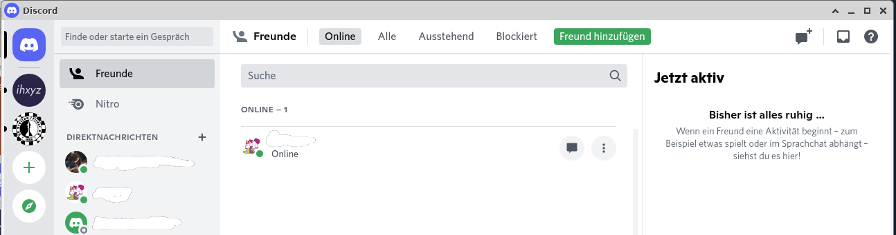
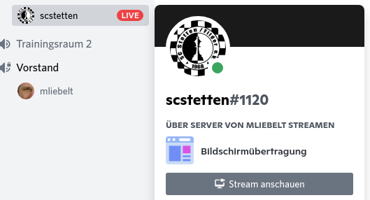
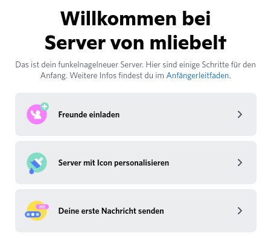

# Discord

Discord besteht aus einem Server, der nur von einem Benutzer erstellt wird, und von einem Client, den die Anwender dann benutzen. Dieses Dokument stellt im Wesentlichen die Grundzüge der Nutzung vor, Servererstellung ist nicht im Fokus.

* [Installation](#installation)
* [Aufruf und Anmeldung](#aufruf-und-anmeldung)
* [Aufbau von Discord](#aufbau-von-discord)
  * [Anwendung Discord](#anwendung-discord)
  * [Browser Discord](#browser-discord)
  * [Auswahl Server](#auswahl-server)
* [Nutzung von Textkanälen](#nutzung-von-textkanälen)
* [Nutzung von Sprachkanälen](#nutzung-von-sprachkanälen)
* [Weitere Eigenschaften von Discord](#weitere-eigenschaften-von-discord)
* [Anlegen eines Servers](#anlegen-eines-servers)
  * [Leute einladen](#leute-einladen)
  * [Text- und Sprachkanäle bereitstellen](#text--und-sprachkanäle-bereitstellen)

## Installation

Beim Öffnen der [Discord-Website](https://discord.com/) wird man direkt darauf hingewiesen, dass es (passend zum Betriebssystem) eine Anwendung gibt, die man herunterladen und installieren kann. Das ist einfacher dann, da mit der Anwendung meist auch gleich die Anmeldung automatisch ist. Ansonsten kann man das auch über die Seite [Discord-Download](https://discord.com/download) tun.

## Aufruf und Anmeldung

Wenn man die installierte Anwendung aufruft, dann wird man beim ersten Mal nach seinem Account gefragt. Man kann Discord nicht ohne Anmeldung nutzen!

Bei der Registrierung muss man die folgenden Daten angeben:

* Email-Adresse
* Benutzername (frei wählbar)
* Password (nicht verraten, sicher speichern)
* Geburtsdatum
* Haken bei Nutzungsbedingungen

Eventuell kommen noch andere Schritte, aber das ist der übliche Registrierungsprozess.

Wenn man dann Discord schließt, und die Anwendung wieder öffnet, ist man automatisch auch wieder angemeldet.

## Aufbau von Discord

Im Folgenden wird nicht zwischen Discord im Browser und der Anwendung unterschieden, hier aber kurz die Unterschiede der beiden.

| Gemeinsamkeiten und Unterschiede | Anwendung | Browser |
|----------------------------------|-----------|---------|
| Anmeldung | Immer angemeldet | Hängt an den Cookies im Browser |
| Unterschiede in der UI | Keine | Keine |
| Zugriff auf Mikrophon | Kein Problem, funktioniert immer | Muss im Browser explizit erlaubt werden. |

Mehr fällt mir zum Thema nicht ein.

### Anwendung Discord

Unten

### Browser Discord

Unten

### Auswahl Server

Wenn man einen Server ausgewählt hat, dann wird die Struktur wesentlich durch den Server bestimmt. 2 neue Teile:

* Linke Spalte
  * Textkanäle oben (Text Channels): Dort kann man Links austauschen, Kommentare hinterlassen, ...
  * Sprachkanäle unten (Voice Channels): Diese entsprechen den Räumen in Zoom, d.h. wenn man auf einen Sprachkanal klickt, und es befinden sich Personen im Sprachkanal, dann kann man sich mit den Personen unterhalten.
* Rechte Spalte: Dort sieht man, wer zur Zeit online ist, auch wenn die Personen aktuell nicht im Discord-Server aktiv sind. Natürlich nur die Personen, die man persönlich kennt.

## Nutzung von Textkanälen

Textkanäle sind, wie der Name sagt, für die Kommunikation per Text. Die Textkanäle strukturieren hier ein wenig, damit die Textnachrichten der Schach-AG nicht durcheinander gehen mit denen des Vereinsabends oder der Vorstandssitzung. Ein Discord-Anwender kann zu einem Zeitpunkt an genau einem Textkanal beteiligt sein. Auf der rechten Seite werden dann die aktuellen Textnachrichten angezeigt.

In Textkanälen werden die Links von Lichess geshart. Die Schüler müssen dies lernen, aber wenn sie das mal verstanden haben, dann wissen sie, dass sie auf die Links klicken müssen, um dann im Browser in Lichess die entsprechende Studie (oder was auch immer) zu sehen.
## Nutzung von Sprachkanälen

Man kann als Teilnehmer von Discord immer nur mit einem Server, und dort mit einem Sprachkanal verbunden sein. Man sieht zu jedem Zeitpunkt, wer aktuell im Sprachkanal verbunden ist, und sich zurzeit unterhalten kann.

Jeder Teilnehmer eines Sprachkanals kann die individuelle Lautstärke jedes einzelnen Teilnehmers einstellen. Damit können Unterschiede der Mikrofone und Einstellungen bei den anderen Teilnehmern ausgeglichen werden.

Neuerdings hat auch der Sprachkanal einen Chat, den haben wir noch nie verwendet. Eventuell wäre der für individuelle Trainingssessions eher geeignet.

Im Sprachkanal kann man sehen, ob Teilnehmer verbunden sind, aktuell sprechen, usw. usf. Hier einige der wichtigsten Merkmale:

* Hat ein Teilnehmer sein Mikrofon abgestellt, ist das in der Liste sichtbar. 
* Spricht ein Teilnehmer, dann ist um seinen Namen ein grüner Kreis. 
* Hat ein Teilnehmer auch die Ausgabe deaktiviert, dann hört er nichts mehr. 

## Weitere Eigenschaften von Discord

Discord kann auch verwendet werden in ähnlicher Form wie Zoom. Von Zeit zu Zeit verwenden wir im Jugendtraining auch die Möglichkeit, den Bildschirm zu übertragen. Daneben ist es für die Kinder und Jugendlichen ab und an auch nett, wenn sie ihre Kamera anschalten, sodass andere sie sehen können.

Hier sieht man, wie es aussieht, wenn man die Kamera angeschaltet hat.

Wenn man den Bildschirm überträgt, funktioniert das so ähnlich.

Für einen Teilnehmer sieht das so aus.

Zum Anschalten muss man nur auf den Live-Knopf drücken, und anschließend im Dialog bestätigen.

Zum Beenden dann im Livebildschirm "Hörer auflegen" drücken.

## Anlegen eines Servers

Auch wenn man nicht ständig neue braucht, jemand muss es initial für die anderen tun.

Das Anlegen eines Servers ist trivial, man drückt den Knopf, beantwortet einige Fragen, fertig. Nachdem man den Server angelegt hat, muss man noch einige Dinge tun:

* Leute einladen
* Text- und Sprachkanäle bereitstellen
* (eventuell) Rechtevergabe an die registrierten Benutzer

### Leute einladen

Es gibt verschiedene Möglichkeiten das zu tun. Wenn man die Leute (auf Discord) kennt, dann einfach direkt einladen. Hier die verschiedenen Möglichkeiten.

Drücken von "Server von XX" Dropdown

 !

Auswahl aus dem Menü

Oder einfach den zentralen Einstieg

Am Ende kann man die Leute direkt anschreiben, oder sie per Einladungslink einladen.

Wenn die Leute auf den Einladungslink klicken, und sich bereits in Discord registriert hatten, dann wird der Server automatisch der linken Leiste im Discord hinzugefügt.

### Text- und Sprachkanäle bereitstellen

Wenn man ein Administrator eines Servers ist, dann hat man die Möglichkeit, zu den initial angelegten Text- und Sprachkanälen (general bzw. General) weitere hinzuzufügen. Normale Benutzer können nur Kanäle nutzen, die bereits vorhanden sind.
