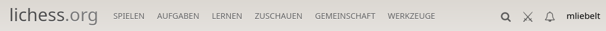
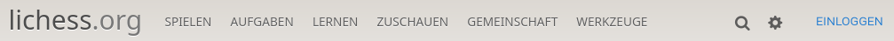

# Lichess

* [Installation von Lichess](#installation-von-lichess)
* [Aufruf von Lichess](#aufruf-von-lichess)
* [Anmeldung bei Lichess](#anmeldung-bei-lichess)
	* [Anmeldung](#anmeldung)
	* [Registrierung](#registrierung)
* [Aufbau von Lichess](#aufbau-von-lichess)
* [Nutzung von Studien](#nutzung-von-studien)
* [Erstellung und Nutzung eines Teams](#erstellung-und-nutzung-eines-teams)
* [Nutzung des Simultan](#nutzung-des-simultan)
* [Nutzung von internen Turnieren](#nutzung-von-internen-turnieren)
* [Weitere Möglichkeiten für das Training](#weitere-möglichkeiten-für-das-training)

Diese Datei enthält die wichtigsten Begriffe, die während des Workshops genutzt werden. Es wird bewusst darauf verzichtet, schon zu erklären, wie das Training mit der Hilfe von Lichess erfolgt. Dies erfolgt an einer anderen Stelle.

## Installation von Lichess

Wir nutzen Lichess immer im Browser (wenn möglich), deshalb ist keine Installation notwendig. Die Lichess-App auf Android (und vermutlich Apple-Geräten) bietet einen ähnlichen Funktionsumfang an. Die Nutzung von Lichess im Browser ist einfacher, und man hat auch alle Feature nur da.

## Aufruf von Lichess

Lichess ist eine umfangreiche Anwendung, die über das Internet erreichbar ist. Im Regelfall nutzen Benutzer bei Lichess ihren installierten Browser (Chrome, Firefox, MS Edge, ...). Der Browser sollte relativ aktuell sein, damit auch alle Möglichkeiten von Lichess uneingeschränkt genutzt werden können.

Lichess wird geöffnet, indem man die URL [https://lichess.org](https://lichess.org) öffnet. Man sieht dann die Homepage von Lichess, unter Umständen ist man schon angemeldet.

Es gibt auch Anwendungen für mobile Endgeräte, z.B. für das Handy, oder auch für Tablets. Diese sollen nun nicht weiter betrachtet werden, hier mag es teilweise Unterschiede geben, das Meiste wird aber für die Anwender gleich funktionieren.

Dabei muss man sich in der Benutzeroberfläche zuerst einmal zurechtfinden.

Unter den Buttons "SPIELEN" usw. verbergen sich jeweils Untermenüs, die werden in [Lichess Menüs](lichess.md) dargestellt werden.

Wichtig ist das Zahnrad, mit dem alle Einstellungen Gallerie
Wenn im Workshop oder in weiteren Abschnitten erklärt wird, wie man wohin kommt, wird meist folgende Syntax verwendet: `Spielen > Simultanschach` bedeutet dann, dass man im Menü `Spielen` das Untermenü `Simultanschach` aufrufen soll.

Die Menüstruktur ändert sich ein wenig, wenn man nicht angemeldet ist.

## Anmeldung bei Lichess

Man kann Lichess sofort nutzen, auch wenn man nicht angemeldet ist. Und im Training mit den Trainingsteilnehmern ist es meist nicht unterschiedlich, ob die Teilnehmer angemeldet sind oder nicht. Es ist besser, wenn alle, die Lichess regelmäßig nutzen, sich dort auch anmelden. Erst als angemeldeter Benutzer von Lichess kann man einige der Feature sinnvoll nutzen. Das wichtigste Feature hier ist, dass man Wertungspunkte nur gewinnen kann, wenn man angemeldet ist. Auch eine aktive Teilnahme an Studien geht erst angemeldet.

### Anmeldung

Wenn man sich schon registriert hatte, dann sollte

* entweder man schon angemeldet sein (siehe )
* oder sich durch Drücken des Buttons "EINLOGGEN" anmelden können. 

### Registrierung

Im Anmelde-Bildschirm gibt es eine Möglichkeit, sich zu registrieren.

Im folgenden Formular hat man einen Benutzernamen zu wählen, ein Passwort anzugeben (dabei sollte die Passwortstärke ausreichend sein) und eine Email angeben. Nach Bestätigung der Checkboxen und der Bestätigung, dass man ein Mensch ist, bekommt man eine Email geschickt, um die Anmeldung abzuschließen.

## Aufbau von Lichess

Es gibt einige Grundprinzipien, die hilfreich sind:

* Links oben (lichess.org) kommt man immer zur Homepage.
* Die Einstiege in die folgenden Teile sind:
  * Studien: `Lernen > Studien`
  * Simultan: `Spielen > Simultanschach`
  * Interne Turniere: `Gemeinschaft > Teams > Auswahl des Teams > Turniere links`
* Damit man interne Turniere spielen kann benötigt man ein Team.

## Nutzung von Studien

## Erstellung und Nutzung eines Teams

* Erstellung
  * `Gemeinschaft > Teams > Neues Team`
  * Ausfüllen des Formulars
  * Éntweder Beitrittsanfragen manuell prüfen oder Passwort vergeben (um die Teammitglieder zu begrenzen)
  * Der Ersteller ist  automatisch der Teamleader, und kann andere Teamleader noch bestellen.
* Beitritt
  * Beitrittsanfragen prüfen
    * Mögliche Mitglieder gehen auf die Teamseite.
    * Button "Tritt dem Team bei"
    * Anfrage verschicken.
    * Einer der Teamleiter muss dem zustimmen.
  * Passwort
    * Gleicher Ablauf wie oben.
    * Statt Prüfung durch andere Eingabe des Passworts.

Nach Erstellung des Teams sind die folgenden Varianten (Simultan, Turnier) teamintern erst möglich.

## Nutzung des Simultan

## Nutzung von internen Turnieren

## Weitere Möglichkeiten für das Training
