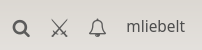
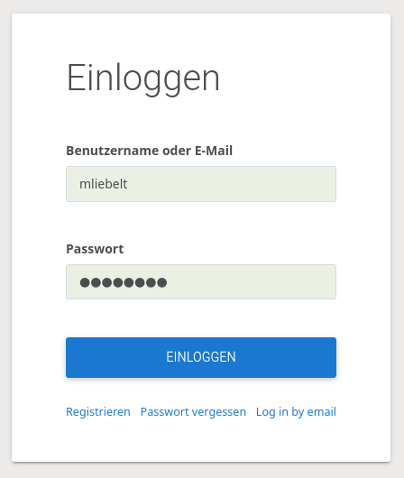

# Lichess

* [Aufruf von Lichess](#aufruf-von-lichess)
* [Anmeldung bei Lichess](#anmeldung-bei-lichess)
	* [Anmeldung](#anmeldung)
	* [Registrierung](#registrierung)
* [Aufbau von Lichess](#aufbau-von-lichess)
* [Nutzung von Studien](#nutzung-von-studien)
* [Nutzung des Simultan](#nutzung-des-simultan)
* [Weitere Möglichkeiten für das Training](#weitere-möglichkeiten-für-das-training)

Diese Datei enthält die wichtigsten Begriffe, die während des Workshops genutzt werden. Es wird bewusst darauf verzichtet, schon zu erklären, wie das Training mit der Hilfe von Lichess erfolgt. Dies erfolgt an einer anderen Stelle.

## Aufruf von Lichess

Lichess ist eine umfangreiche Anwendung, die über das Internet erreichbar ist. Im Regelfall nutzen Benutzer bei Lichess ihren installierten Browser (Chrome, Firefox, MS Edge, ...). Der Browser sollte relativ aktuell sein, damit auch alle Möglichkeiten von Lichess uneingeschränkt genutzt werden können.

Lichess wird geöffnet, indem man die URL [https://lichess.org](https://lichess.org) öffnet. Man sieht dann die Homepage von Lichess, unter Umständen ist man schon angemeldet.

Es gibt auch Anwendungen für mobile Endgeräte, z.B. für das Handy, oder auch für Tablets. Diese sollen nun nicht weiter betrachtet werden, hier mag es teilweise Unterschiede geben, das Meiste wird aber für die Anwender gleich funktionieren.

## Anmeldung bei Lichess

Man kann Lichess sofort nutzen, auch wenn man nicht angemeldet ist. Und im Training mit den Trainingsteilnehmern ist es meist nicht unterschiedlich, ob die Teilnehmer angemeldet sind oder nicht. Es ist besser, wenn alle, die Lichess regelmäßig nutzen, sich dort auch anmelden. Erst als angemeldeter Benutzer von Lichess kann man einige der Feature sinnvoll nutzen. Das wichtigste Feature hier ist, dass man Wertungspunkte nur gewinnen kann, wenn man angemeldet ist. Auch eine aktive Teilnahme an Studien geht erst angemeldet.

### Anmeldung

Wenn man sich schon registriert hatte, dann sollte

* entweder man schon angemeldet sein (siehe )
* oder sich durch Drücken des Buttons "EINLOGGEN" anmelden können. 

### Registrierung

Im Anmelde-Bildschirm gibt es eine Möglichkeit, sich zu registrieren.

Im folgenden Formular hat man einen Benutzernamen zu wählen, ein Passwort anzugeben (dabei sollte die Passwortstärke ausreichend sein) und eine Email angeben. Nach Bestätigung der Checkboxen und der Bestätigung, dass man ein Mensch ist, bekommt man eine Email geschickt, um die Anmeldung abzuschließen.

## Aufbau von Lichess

## Nutzung von Studien

## Nutzung des Simultan

## Weitere Möglichkeiten für das Training

