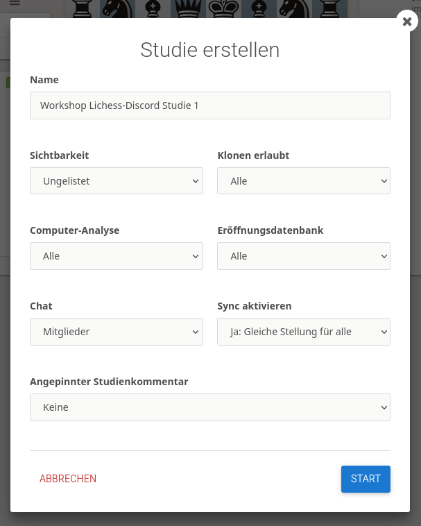
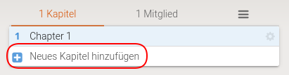
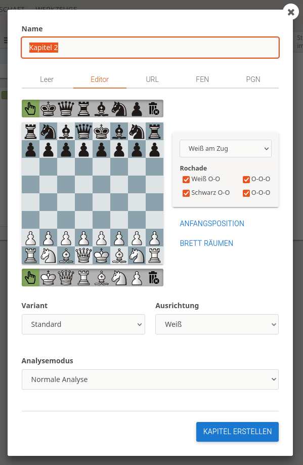

# Online Training

Diese Seite fasst die wesentlichen Aspekte des Online-Trainings zusammen. Dabei kommen wir nicht von den Hilfsmitteln, die wir einsetzen wollen (die sind nur referenziert, damit man die Details an anderer Stelle  nachlesen kann), sondern von dem, was wir trainieren möchten, und wie das vorbereitet und unterrichtet werden kann.

Was sind die verschiedenen Elemente?

* Klassischer Unterricht über Studien: Der Schachtrainer führt, zeigt Material, erklärt, die Schüler kommentieren, probieren aus, ...
* Lernmaterial für Schüler: Studien können auch dazu genutzt werden, Selbstlernmaterial zu erstellen. Das kann von den Schülern dann eigenständig durchgearbeitet werden.
* Partieanalysen: Vorbereitung, Selbstanalyse, Durchsprache im Unterricht, wie geht das mit Lichess?
* Turniere der Schüler (und Lehrer): Praktisches üben, freies Spiel, Wettbewerb.
* Simultan des Lehrers: Praktische Übung von Beispielstellungen, Endspieltraining praktisch, ...
* Sonstiges: Auflockerung, kleine Wettkämpfe, Vorschläge an die Schüler, ...

Natürlich sollte auch ein Online-Training eine Struktur haben, Abwechslung, einen lernenden und übenden Teil usw., das wird hier nur am Rande erwähnt.

* [Unterricht über Studien](#unterricht-über-studien)
  * [Erarbeiten des Themas](#erarbeiten-des-themas)
  * [Durchnehmen des Themas](#durchnehmen-des-themas)
* [Selbststudium](#selbststudium)
* [Partieanalysen](#partieanalysen)
* [Durchsprache der Analysen](#durchsprache-der-analysen)
* [Turniere der Schüler](#turniere-der-schüler)
* [Simultan des Lehrers](#simultan-des-lehrers)
* [Sonstiges](#sonstiges)

## Unterricht über Studien

**Ausgangspunkt**: Wir haben ein Thema, und wollen das den Schülern nahebringen.

**Ziel**: Die Schüler sollten am Ende genügend über das Thema verstanden haben, um es dann in der Praxis auch anwenden zu können.

### Erarbeiten des Themas

1. Gibt es schon eine Studie, in die das Thema reinpasst? Es müssen so viele Kapitel noch frei sein (< 64), wie vermutlich benötigt werden.
2. Wenn nicht, muss erst eine neue Studie erstellt, und entsprechend benannt werden.

3. Erstellen eines Kapitels

dann

  * Sinnvollen Namen vergeben
  * Variant: Standard
  * Ausrichtung: Aus welcher Perspektive später zeigen?
  * Position bestimmen: den richtigen Tab wählen (die Züge kommen dann später)
  * Analysemodus: Nächste Züge ausblenden

Siehe die Studie [Anfänger: Schäfermatt verteidigen 1](https://lichess.org/study/eSxsNxVy/K4ZcQok3)

### Durchnehmen des Themas

Wenn man nun die Studie durchnehmen möchte, dann hat man oft den folgenden Ablauf (vorausgesetzt, das Erarbeiten ist komplett abgeschlossen):

1. Die Schüler bekommen über Discord den Link zur Studie zur Verfügung gestellt. Man verwendet dazu am besten "URL des aktuellen Kapitels".
2. Die Schüler sehen die gleiche Studie wie der Lehrer, und das gleiche Kapitel. Trotzdem: Pfeil-Test! Auf der Stellung einen Pfeil ziehen, und fragen, ob sie was sehen. (siehe SYNC-Thema)
3. Man geht wie sonst im Schachunterricht durch die Züge durch, die Kommentare sind (bei mir) oft Hinweise für den Trainer. Welche Fragen, wann pausieren, was sollen die Schüler selbst herausbekommen.
4. Ich verwende bei den wichtigen Zügen die Schachnotation (!, !!, ?, ...) sowie die Farben für Züge/Drohungen/Fehler/... Das muss jeder selbst herausbekommen, wo was wie nützlich ist. (siehe Nutzung von Lichess-Annotationen)

## Selbststudium

Ausgangspunkt: Die Schüler haben ein Thema vorgestellt und erklärt bekommen, und sollen nun an Übungen zeigen, dass sie es verstanden haben.

Ziel: Jeder Schüler sollte die Übungen absolvieren können, und am Ende eine Vorstellung haben, ob er erfolgreich war, d.h. alles verstanden hat, oder ob er noch Probleme hat.

## Partieanalysen

Ausgangspunkt: Die Schüler haben in Turnieren teilgenommen, und sollen ihre Partien dann selbständig analysieren.

Ziel: Die Analyse zeigt, dass der Schüler die wichtigsten Aspekte seiner Partie verstanden hat, und einige Fehler selbständig gefunden hat.

## Durchsprache der Analysen

Ausgangspunkt: Die Analysen liegen vor.

Ziel: In der Durchsprache der Analysen findet man Lücken, nutzt einige der (zusätzlichen) Möglichkeiten von Lichess, und kommt zu tieferen Einsichten.

## Turniere der Schüler

Ausgangspunkt: Die Schüler sollen praktisch in Partien Erfahrungen sammeln.

Ziel: Jeder hat Spaß gehabt und war mehr oder weniger erfolgreich.

## Simultan des Lehrers

Ausgangspunkt: Manche Lerninhalte können durch ein Simultan besser geübt werden. Manchmal macht es auch einfach Spaß, mit vielen gleichzeitig gegen einen Besseren zu spielen.

Ziel: Im Simultan kann jeder Schüler sehen, ob er das Gelernte umsetzen konnte.

## Sonstiges

Ziel: Welche anderen Möglichkeiten von Lichess können auch im (Online-)Training eingesetzt werden?